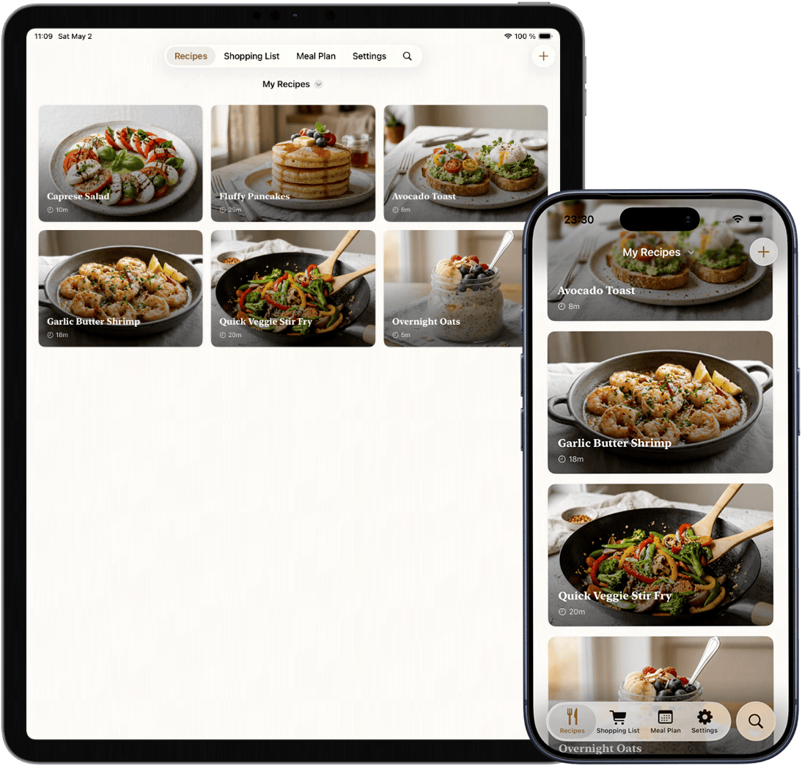
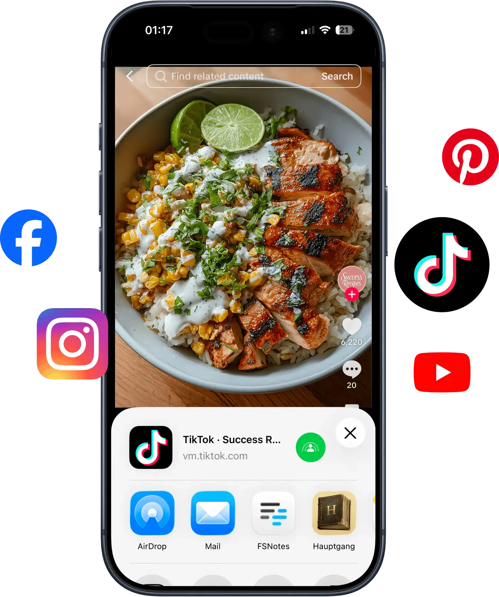
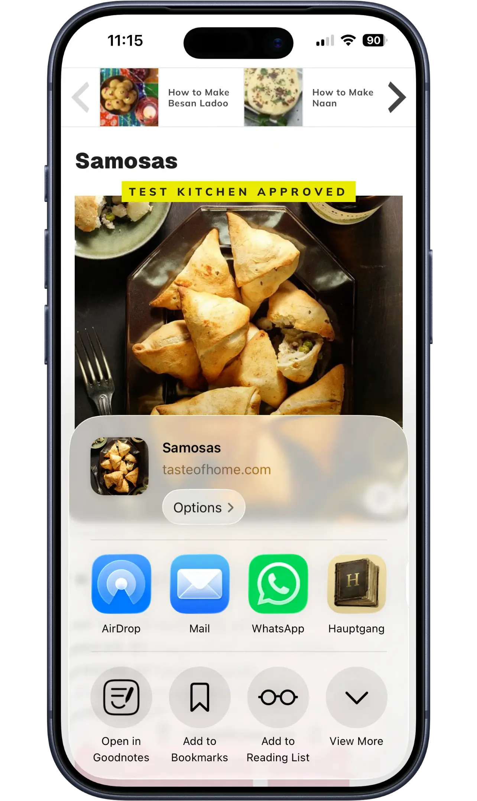
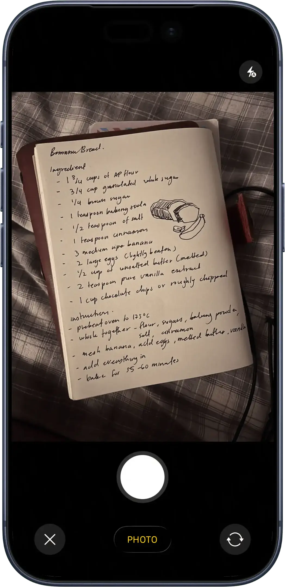
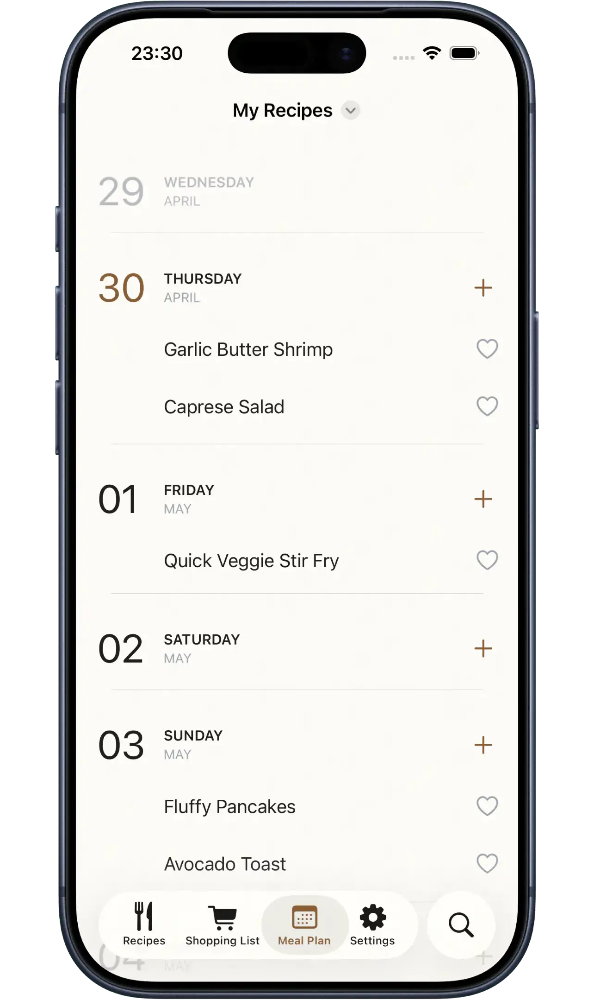
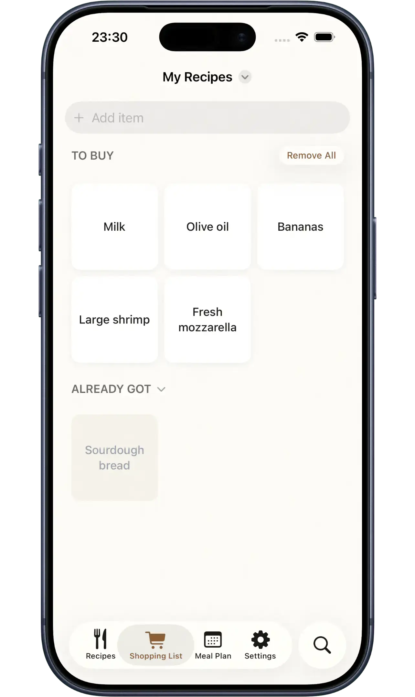

# Hauptgang

**Every recipe you love. In one place.**

Hauptgang is a recipe manager for iPhone and iPad. Save recipes from websites, Instagram, TikTok, YouTube, or photos of cookbook pages — then plan your week and turn it into a single shopping list grouped by aisle.

<p align="center">
  
</p>

Landing page: [hauptgang.app](https://hauptgang.app)

---

## What it does

### Rescue recipes from Instagram, TikTok, and YouTube
Share a reel or video to Hauptgang and the server transcribes the audio, reads on-screen text, and turns it into a structured recipe you can actually cook from.



### Save from any website
Paste a link from any recipe site and Hauptgang pulls in the ingredients, steps, and photo automatically — using JSON-LD when available, or an LLM as a fallback.



### Snap a photo of a cookbook page
Point your camera at a handwritten card or an open cookbook. Hauptgang uses on-device OCR to turn the photo into an editable recipe in seconds.



### Plan the whole week at a glance
Drop recipes onto any day of the week and see your meals laid out in a clean calendar. Rearrange, repeat, or swap dishes in seconds.



### One shopping list, grouped by aisle
Hauptgang turns your meal plan into a single, consolidated shopping list — quantities combined, items grouped by aisle.



---

## Architecture

Hauptgang is split into two main pieces:

- **Rails 8.1 API backend** (`app/`, `config/`, `db/`) — Ruby 3.4.7, SQLite multi-database (primary + Solid Cache / Queue / Cable), Hotwire for the web admin views. Handles recipe extraction (URL, social, photo), user accounts, sharing, and sync.
- **SwiftUI iOS app** (`hauptgang-ios/`) — Offline-first iPhone and iPad client. Generated with XcodeGen, uses RevenueCat for subscriptions.

See [`architecture.md`](architecture.md) for a deeper look at how the pieces fit together, and [`written_proposal.md`](written_proposal.md) for the original project proposal. Feature-area guides live in [`docs/`](docs/).

The landing page is a separate Astro project at [`../hauptgang-landing`](../hauptgang-landing).

---

## Development

Requires Ruby 3.4.7 and SQLite.

```bash
bin/setup                  # install deps, prepare DB, start server
bin/setup --skip-server    # same, without starting the server
bin/dev                    # start the Rails dev server
```

The iOS project file is generated — run `xcodegen` inside `hauptgang-ios/` after changing `project.yml`.

### Quality checks

```bash
bin/ci             # full CI suite: style, security, tests
bin/rubocop -a     # auto-fix Ruby style
bin/rails test     # Rails tests
bin/ios-test       # iOS tests (auto-finds simulator, macOS only)
```

`bin/ci` runs rubocop, brakeman, bundler-audit, importmap audit, iOS linting, Rails tests, system tests, and seed verification.

A regression test suite for recipe extractors using cached HTML snapshots is documented in [`docs/recipe-import-corpus.md`](docs/recipe-import-corpus.md) — see the `recipe_corpus:*` rake tasks.

---

## Deployment

Deployed with Kamal to a Hetzner VPS. SQLite databases and uploads persist in a Docker volume; backups go to S3 via Litestream (see [`docs/sqlite-backups-litestream.md`](docs/sqlite-backups-litestream.md)).

```bash
kamal deploy       # full deploy
kamal app logs     # tail logs
bin/logs           # attach lazyjournal to production
```
